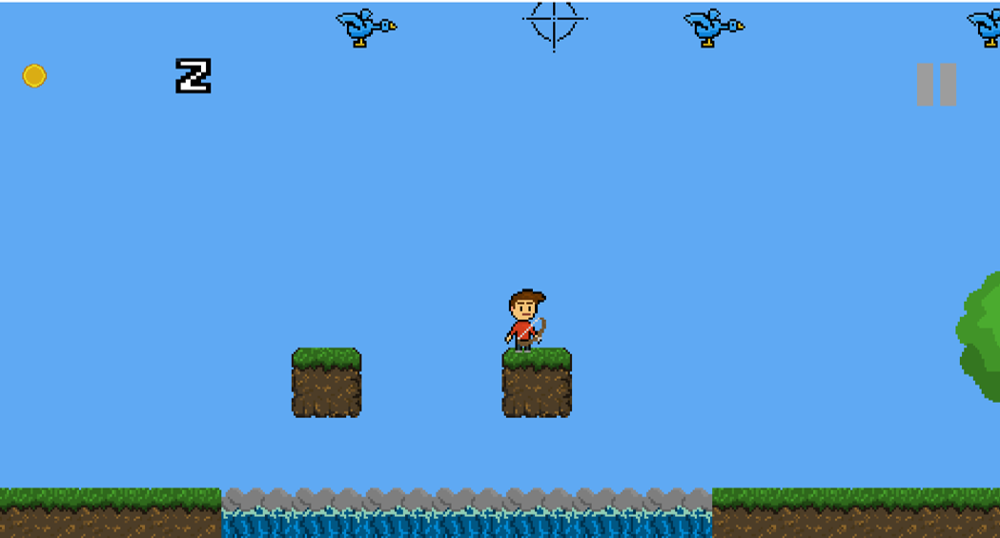
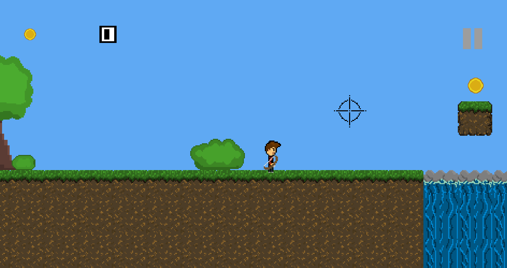
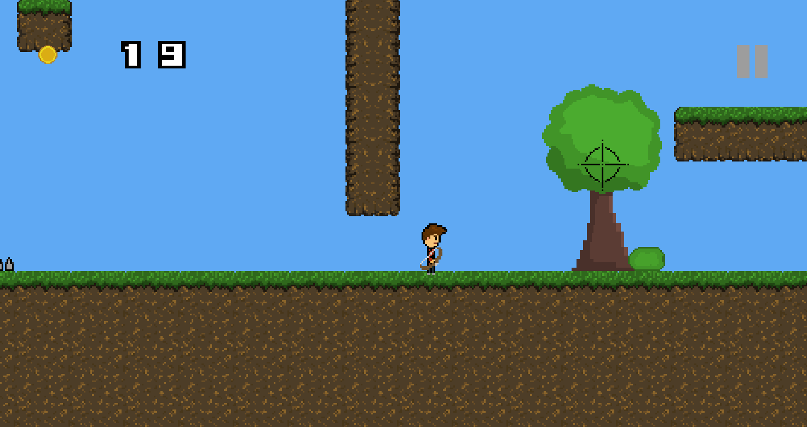
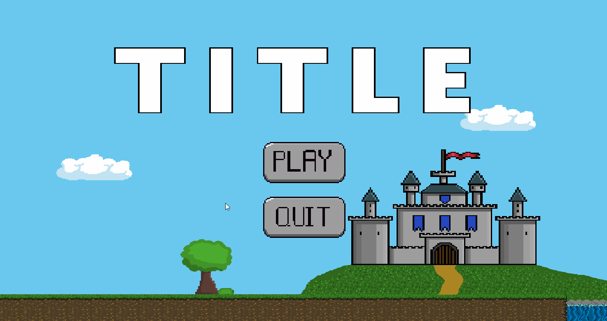

# Game

## Introduction
This is a 2d platformer game and game engine created using C++ and SDL. The game engine works by alternating through different states(menu,map,game,pause) and using a map to load in different levels. Maps are stored as text files with each number representing a different block type or character.

This game is still in progress, and I'm using it to explore multiple different programming techniques and patterns.

## Technologies
C++ SDL2
